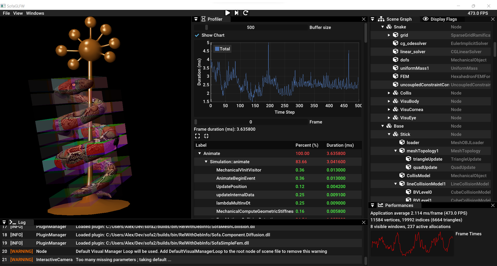

## SofaGLFW
This SOFA plugin brings a simple GUI based on GLFW (a spiritual successor of Glut).

It only needs Sofa.Simulation.Graph, Sofa.Component.Visual, Sofa.GUI.Common and Sofa.GL as dependencies.
Integration of GLFW is automatic (automatic fetching and integration with CMake), and linked statically (does not need a glfw.dll to be shipped with)

This GUI is launchable with the standard runSofa (with the parameter "-g glfw"), or can be used with a (provided) stand-alone executable `runSofaGLFW` (which needs much less dependencies than runSofa)

Lastly, this GUI was designed to support multiple windows in the same time and multiple simulations. 

### Dependencies

#### Linux

Unix-like systems such as Linux need a few extra packages for GLFW. Read the documentation on the [GLFW website (section `Installing dependencies`)](https://www.glfw.org/docs/latest/compile_guide.html).
**For example**, if you are on Ubuntu running X11, you need to do:

```
sudo apt install xorg-dev
```


#### Others

No dependencies

### Keyboard Shortcuts

* CTRL+F: switch to fullscreen
* Escape: close the app
* Space: play/pause the simulation

### Command Line Options

`runSofaGLFW` accepts the following command line options:
* `-f` or `--file` to specify the scene file to load. If not defined, the default scene file `Demos/caduceus.scn` is loaded.
* `-a` or `--start`: if true, starts the simulation just after opening. True by default.
* `-s` or `--fullscreen`: set full screen at startup. False by default.
* `-l` or `--load`: load given plugins as a comma-separated list. Example: -l SofaPython3

## Dear ImGui

By default, SofaGLFW does not show any user interface.
Only the keyboard allows limited interactions with the simulation.
That is why a user interface based on [Dear ImGui](https://github.com/ocornut/imgui) is provided.

By default, this interface is not compiled.
The CMake variable `SOFA_BUILD_SOFAGLFWIMGUI` must be set to `ON`.

Integration of Dear ImGui is automatic (automatic fetching and integration with CMake), and linked statically.

### Dependencies

The GUI relies on the [NFD-extended library](https://github.com/btzy/nativefiledialog-extended).
Therefore, it comes with its dependencies. See the list on [GitHub](https://github.com/btzy/nativefiledialog-extended#dependencies).

### Windows

The GUI is based on dockable windows.
Each window gathers related features.
Here are all the available windows:

| Window            | Description                                                                      |
|-------------------|----------------------------------------------------------------------------------|
| __Performances__  | display simple metrics related to application performances: ms/frame, FPS, graph |
| __Profiler__      | display detailed metrics related to the physics loop performances                |
| __Scene Graph__   | show the scene graph and the Data associated to each components                  |
| __Display Flags__ | filter which components are rendered in the 3D view                              |
| __Plugin__        | show a list of plugins currently loaded                                          |
| __Components__    | show a detailed list of components currently loaded                              |
| __Log__           | all the messages sent by SOFA                                                    |

### Screenshots


